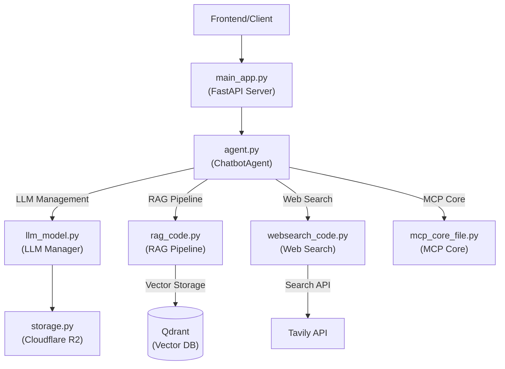

# Enhanced Chatbot System with RAG Pipeline

## Architecture Overview



## Component Description

### 1. main_app.py (FastAPI Server)
- Main entry point for the application
- Handles HTTP endpoints and request routing
- Manages agent lifecycles and session state
- Integrates with Cloudflare R2 storage

### 2. agent.py (ChatbotAgent)
- Core orchestrator for the chatbot system
- Integrates all components (RAG, LLM, Web Search, MCP)
- Manages conversation context and memory
- Handles document processing and retrieval

### 3. llm_model.py (LLM Manager)
- Unified interface for multiple LLM providers:
  - OpenAI
  - Anthropic (Claude)
  - Google (Gemini)
  - Groq
  - OpenRouter
- Handles model selection and request routing
- Manages API keys and configurations

### 4. rag_code.py (RAG Pipeline)
- Implements Retrieval Augmented Generation
- Manages document processing and chunking
- Integrates with Qdrant vector database
- Handles hybrid search (Vector + BM25)

### 5. websearch_code.py (Web Search)
- Integrates with Tavily API for web search
- Manages search result caching
- Filters and processes web content
- Integrates with RAG pipeline

### 6. mcp_core_file.py (MCP Core)
- Implements Model Context Protocol
- Manages server selection and subprocess handling
- Handles JSON-RPC communication
- Integrates with LLM for query analysis

### 7. storage.py (Cloudflare R2)
- Handles document storage and retrieval
- Manages file lifecycle and cleanup
- Provides local fallback when needed
- Integrates with all components

## Setup and Dependencies

### Environment Requirements
```txt
Python 3.9+
FastAPI
Qdrant
Cloudflare R2 Storage
```

### Configuration
Required environment variables in `.env`:
```env
OPENAI_API_KEY=your_key
ANTHROPIC_API_KEY=your_key
GOOGLE_API_KEY=your_key
TAVILY_API_KEY=your_key
CLOUDFLARE_ACCOUNT_ID=your_id
CLOUDFLARE_ACCESS_KEY_ID=your_key
CLOUDFLARE_SECRET_ACCESS_KEY=your_key
QDRANT_URL=your_url
QDRANT_API_KEY=your_key
```
- For LANGSMITH Tracing
```LANGSMITH_TRACING=true
LANGSMITH_ENDPOINT="https://api.smith.langchain.com"
LANGSMITH_API_KEY=YOUR_API_KEY
LANGSMITH_PROJECT="Project_Name"
```

### Installation
```bash
pip install -r requirements.txt
```

### Running the Server
```bash
uvicorn main_app:app --host 0.0.0.0 --port 8000
```

## Key Features
- Multi-model LLM support
- Hybrid search (Vector + BM25)
- Web search integration
- Document processing
- Conversation memory
- MCP support
- R2 storage integration
- Async processing